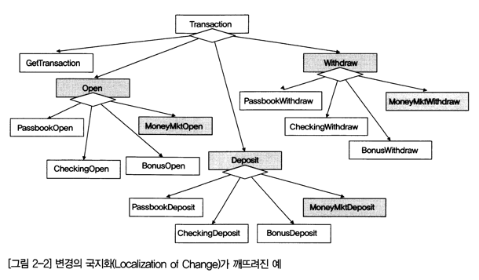
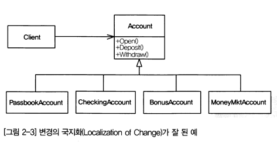

# 디자인 패턴 

### 어느 순간 사라져 버린, 디자인 패턴 
한때 소프트웨어 개발에서 모든 논의의 핵심은 디자인 패턴(Design Pattern)이었다.
개발자들은 밤을 세워가며 객체(Object), 응집도(Cohesion), 결합도(Coupling)에 
대해 진지한 토론을 벌이기도 했다. 패턴이라고 하는 것은 일정한 형태나 양식 또는 유형을 
의미한다. 소프트웨어를 설계할 때 패턴을 모르는 개발자는 자질(?)이 있는지 의심하는 
정도의 분위기였다. 객체지향(Object-oriented)을 공부해야 하는 사람은 반드시 넘어야 
할 산(山)이 디자인 패턴이었다.  

그러나 어느 순간부터 온/오프라인에서 디자인 패턴에 대한 관심과 디자인 패턴을 적용하는 
프로그래머를 보기가 어렵다. 왜, 이런 현상이 발생하고 있을까? 그 원인에는 여러가지가 
있지만 과거와 같이 모든것을 자체적으로 해결하던 것을 많은 부분에서 외부에서 만들어 놓은 
부분 소프트웨어(프레임워크, 콤퍼넌트 등)를 활용하여 프로젝트를 수행 및 상용패키지를 
커스트마이징하여 적용하는 빈도가 높아져 일어나는 현상으로 보인다.  

하지만 소프트웨어는 공학이다. 공학에는 원리가 있듯이 소프트웨어 개발도 규칙과 올바른 
해결 방법으로 나아가기위해 노력하고, 갖추어야 할 스킬은 여전히 자료구조, 알고리즘, 
디자인 패턴등이 있다고 생각한다.  

### 디자인 패턴의 개념  
디자인 패턴은 크게 3가지 유형이 있고, 각 유형은 클래스(Class)와 객체(Object) 관점으로
설명할 수 있다.  

| 구분   | 생성 패턴               | 구조 패턴       | 행위 패턴                        |
| ------ | ----------------------- | --------------- | -------------------------------- |
| Class  | Factory                 | Adapter(Class)  | Interpreter Template Method |
| Object | Prototype               | Adapter(Object) | Command                          |
|        | Builder                 | Bridge          | Mediator                         |
|        | Abstract   Factory | Composite       | Memento                          |
|        | Singleton               | Decorator       | Iterator                         |
|        |                         | Facade          | Iterator                         |
|        |                         | Flyweight       | State                            |
|        |                         | Proxy           | Strategy                         |
|        |                         |                 | Visitor                          |

### 디자인 패턴은 정말로 중요성이 작아진 것인가?  
1. 패턴의 대중화  
2. 개발방식의 변화(프레임워크 기반 개발 방식)  
3. 솔루션 기반의 사용 문화(인건비의 부담)  

### 결국 디자인 패턴으로  
그러나 결국 S/W개발은 디자인 패턴이 계속 중요할 것이다. 디자인 패턴은 단순히 개발에만 적용되지 
않고 그 대상 범위가 오히려 확대될 것이다. 

---
## 디자인패턴 서론  

### 좋은 소프트웨어 설계 특징
* 이해 용이성  
    전체 소프트웨어나 개별 구성 요소에 대해 쉽게 이해할 수 있어야 한다.
* 수정 용이성(Modifiability 또는 Flexibility)  
    요구 사항의 변경에 따른 수정이 용이해야 한다.
* 관리 용이성(Maintainability)  
    소프트웨어 유지, 보수, 관리 단계에서 버그 수정이나 장애 대처, 요구사항 변경, 
    성능 향상 등의 이유로 소프트웨어 수정해야 할 경우 이를 쉽게 수행할 수 있어야 한다.
* 재사용 용이성  
    개발된 소프트웨어 구성 요소들을 다른 소프트웨어를 개발할 때 쉽게 재사용 가능해야 한다.
* 테스트 용이성  
    소프트웨어가 원하는 동작이나 기능을 수행하는지 테스트하기 쉬워야 한다.
* 높은 안정성  
    소프트웨어가 오류없이 원하는 작업을 수행할 수 있는 확률이 충분히 높아야 한다.

 이 밖에도 목적을 정확히 만족시켜야 하고, 적은 자원을 사용해서 최대한의 성능을 발휘할 수 있도록 
효율적이어야 하며, 상호 운영성 등도 뛰어나야 한다. 그너나 이런 특성들을 모두 만족 시키기는 사실상 
힘든 경우가 많다. 각 특성간에는 일정부분 상반되는 것들이 존재하기 때문이다. 효율성을 위해 자료구조, 
알고리즘이 복잡해지면 이해 용이성, 수정 용이성등은 떨어질 가능성이 크다. 

따라서 구체적인 목적이나 상황에 맞추어 위 특성들 중 가장 우선해야 할 것들을 선별하고 그에 따라 설계
를 하는 것이 최적의 설계를 이끌어낼 수 있는 방법이라고 할 수 있다.  

### 좋은 소프트웨어를 설계하기 위한 도구
- 추상화와 구체화  
- 모듈화와 계층화  
- 정보 은닉과 변경의 국지화  
  
  
- 방법론 및 지침  

### 디자인 패턴 이해와 활용을 위한 접근 방법  
- 각 디자인 패턴이 어떤 문제를 해결하기 위해 고안된 것인지 집중할 필요가 있다.  

