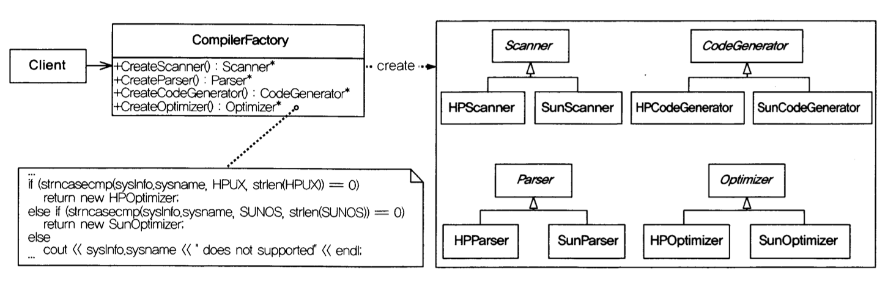
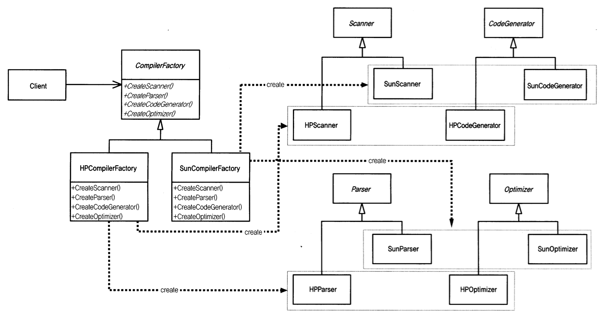
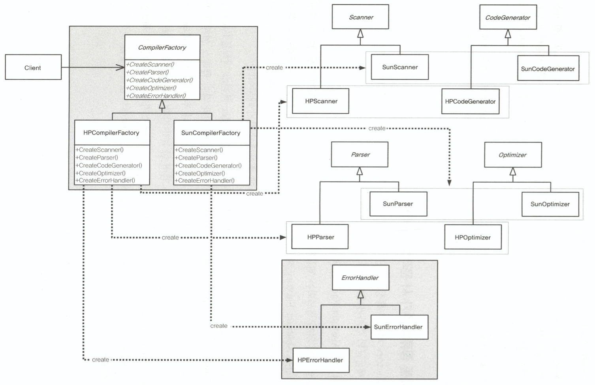

# 제품군별 객체 생성 문제(Abstract Factory)  

## 개요  
하나의 호출(function)이 버전, 환경에 따라 다른 동작이 필요한 경우
우리는 호출 시점에 변수를 추가하거나, 호출된 함수 내에서 일을 처리하려고 한다.
```go
func testA() {
    value := GetVersion() // or GetEnv()
    if value == 1 {
        RunValue1()
    } else if value == 2 {
        RunValue2()
    }
}
```
```go
func testB() {
    value := GetVersion() // or GetEnv()
    if value == 1 {
        value := value + 1 
    } else if value == 2 {
        value := value + 2 
    }
}
```
위와 같은 상황에서 사용할 수 있는 방법에 대해서 확인한다. 

## 실 상황에서 우리의 대처(좋지 못함)
범위가 작은 경우 아래와 같은 코드로도 우리는 충분할 수 있다.  
```go
package main

import (
	"fmt"
	"strings"
)

func main() {
	// Get OS Info : example( HP )
	sysInfo := SysInfo{
		SysName: HPUX,
	}
	err := ScanParse(sysInfo)
	if err != nil {
		fmt.Println("Error Can't Get OS Info")
		return
	}
	err = CodeGenOptimize(sysInfo)
	if err != nil {
		fmt.Println("Error Can't Get OS Info")
		return
	}
}

//goland:noinspection SpellCheckingInspection
const (
	HPUX  = "HPUX"
	SunOS = "SunOS"
)

// default?
type Scanner interface {
}
type Parser interface {
}
type CodeGenerator interface {
}
type Optimizer interface {
}

// for hp
type HPScanner struct {
}
type HPParser struct {
}
type HPCodeGenerator struct {
}
type HPOptimizer struct {
}

// for sunos
type SunScanner struct {
}
type SunParser struct {
}
type SunCodeGenerator struct {
}
type SunOptimizer struct {
}

type SysInfo struct {
	SysName string
}

var (
	scanner       Scanner
	parser        Parser
	codeGenerator CodeGenerator
	optimizer     Optimizer
)

func ScanParse(sysInfo SysInfo) error {
	if strings.Compare(sysInfo.SysName, HPUX) == 0 {
		// create for hp
		scanner = &HPScanner{}
		parser = &HPParser{}
	} else if strings.Compare(sysInfo.SysName, SunOS) == 0 {
		// create for sun
		scanner = &SunScanner{}
		parser = &SunParser{}
	} else {
		return fmt.Errorf("not supported system[ %s ]", sysInfo.SysName)
	}
	return nil
}

func CodeGenOptimize(sysInfo SysInfo) error {
	if strings.Compare(sysInfo.SysName, HPUX) == 0 {
		// create for hp
		codeGenerator = &HPCodeGenerator{}
		optimizer = &HPOptimizer{}
	} else if strings.Compare(sysInfo.SysName, SunOS) == 0 {
		// create for sun
		codeGenerator = &SunCodeGenerator{}
		optimizer = &SunOptimizer{}
	} else {
		return fmt.Errorf("not supported system[ %s ]", sysInfo.SysName)
	}
	return nil
}
```

more batter : localization of change
  

## 국지화와 추상화 팩토리를 이용한 방법  
  
처음 샘플은 각 기능을 담당하는 객체를 생성하기 위해 코드 비교가 필요했다.  
이를 모두 묶어서 처리할 수 있도록 했다. 최초 1번의 처리로 가능해졌다.  
```go
package main

import (
	"fmt"
	"strings"
)

//goland:noinspection SpellCheckingInspection
const (
	HPUX  = "HPUX"
	SunOS = "SunOS"
)

func main() {
	// Get OS Info.. : Example
	info := SysInfo{
		OS: HPUX,
	}
	var factory CompilerFactory
	if strings.Compare(info.OS, HPUX) == 0 {
		// for hp : a signed hp factory
		factory = HPCompilerFactory{}
	} else if strings.Compare(info.OS, SunOS) == 0 {
		// for sun : a signed sun factory
		factory = SunCompilerFactory{};
	} else {
		fmt.Println("not supported os")
		return
	}
	scanner, _ := factory.CreateScanner()
	parser, _ := factory.CreateParser()
	codeGenerator, _ := factory.CreateCodeGenerator()
	optimizer, _ := factory.CreateOptimizer()

	_ = scanner.Scanner()
	_ = parser.Parser()
	_ = codeGenerator.CodeGenerator()
	_ = optimizer.Optimizer()
}

// default?
type Scanner interface {
	Scanner() error
}
type Parser interface {
	Parser() error
}
type CodeGenerator interface {
	CodeGenerator() error
}
type Optimizer interface {
	Optimizer() error
}

type HPScanner struct{}

func (HPScanner) Scanner() error {
	return nil
}

type HPParser struct{}

func (HPParser) Parser() error {
	return nil
}

type HPCodeGenerator struct {
}

func (HPCodeGenerator) CodeGenerator() error {
	return nil
}

type HPOptimizer struct {
}

func (HPOptimizer) Optimizer() error {
	return nil
}

type SunScanner struct {
}

func (SunScanner) Scanner() error {
	return nil
}

type SunParser struct {
}

func (SunParser) Parser() error {
	return nil
}

type SunCodeGenerator struct {
}

func (SunCodeGenerator) CodeGenerator() error {
	return nil
}

type SunOptimizer struct {
}

func (SunOptimizer) Optimizer() error {
	return nil
}

type SysInfo struct {
	OS string
}

type CompilerFactory interface {
	CreateScanner() (Scanner, error)
	CreateParser() (Parser, error)
	CreateCodeGenerator() (CodeGenerator, error)
	CreateOptimizer() (Optimizer, error)
}

type HPCompilerFactory struct {
}

func (HPCompilerFactory) CreateScanner() (Scanner, error) {
	scanner := HPScanner{}
	return scanner, nil
}
func (HPCompilerFactory) CreateParser() (Parser, error) {
	parser := HPParser{}
	return parser, nil
}
func (HPCompilerFactory) CreateCodeGenerator() (CodeGenerator, error) {
	codeGenerator := HPCodeGenerator{}
	return codeGenerator, nil
}
func (HPCompilerFactory) CreateOptimizer() (Optimizer, error) {
	optimizer := HPOptimizer{}
	return optimizer, nil
}

type SunCompilerFactory struct {
}

func (SunCompilerFactory) CreateScanner() (Scanner, error) {
	scanner := SunScanner{}
	return scanner, nil
}
func (SunCompilerFactory) CreateParser() (Parser, error) {
	parser := SunParser{}
	return parser, nil
}
func (SunCompilerFactory) CreateCodeGenerator() (CodeGenerator, error) {
	codeGenerator := SunCodeGenerator{}
	return codeGenerator, nil
}
func (SunCompilerFactory) CreateOptimizer() (Optimizer, error) {
	optimizer := SunOptimizer{}
	return optimizer, nil
}
```

## 구현 관련  
이 장에서는 6, 7장에서 나올 내용을 기본 베이스로 하여 6, 7장을 보고 보는걸 추천함.
6, 7 보러 가자  

## 새로운 종류의 추가 시 문제 해결 방법  
abstract factory 하위주제(기능)들을 동일한 특성(조건)으로 묶어 상위주제(factory)로 
모아서 처리하도록 하여 다른 상위 주제 추가가 용이하도록 한 클래스 설계이다. 
그러나, 하위주제의 추가가 이루어져야 하는 경우 모든 factory에 동일한 코드가 추가되어야 한다.

  

단점을 극복할 수 있는 방법은 없을까? ( 이 이상의 고민은 불필요해보인다. 개인 생각 ) 
다음은 하위 주제들을 interface(product)로 묶고 처리하고 있다.  
하지만 코드가 위 보다 쉬워지거나, 읽기가 편한가 생각해보면 나는 아니다.  
```go
package main

import (
	"fmt"
	"strings"
)

//goland:noinspection SpellCheckingInspection
const (
	HPUX  = "HPUX"
	SunOS = "SunOS"
)

type SysInfo struct {
	OS string
}

const (
	SCANNER       = 1
	PARSER        = 2
	CODEGENERATOR = 3
	OPTIMIZER     = 4
	ERRORHANDLER  = 5 // Add New Func
)

func main() {
	// Get OS Info.. : Example
	info := SysInfo{
		OS: HPUX,
	}
	var factory CompilerFactory
	if strings.Compare(info.OS, HPUX) == 0 {
		// for hp : a signed hp factory
		factory = HPCompilerFactory{}
	} else if strings.Compare(info.OS, SunOS) == 0 {
		// for sun : a signed sun factory
		factory = SunCompilerFactory{}
	} else {
		fmt.Println("not supported os")
		return
	}

	scanner, _ := factory.CreateProduct(SCANNER)
	parser, _ := factory.CreateProduct(PARSER)
	codeGenerator, _ := factory.CreateProduct(CODEGENERATOR)
	optimizer, _ := factory.CreateProduct(OPTIMIZER)
	//errHandler, _ := factory.CreateProduct(ERRORHANDLER)

	_ = scanner.Product()
	_ = parser.Product()
	_ = codeGenerator.Product()
	_ = optimizer.Product()
	//_ = errHandler.Product()
}

type Product interface {
	Product() error
}
type HPScanner struct{}

func (HPScanner) Product() error {
	return nil
}

type HPParser struct{}

func (HPParser) Product() error {
	return nil
}

type HPCodeGenerator struct{}

func (HPCodeGenerator) Product() error {
	return nil
}

type HPOptimizer struct{}

func (HPOptimizer) Product() error {
	return nil
}

type HPErrorHandler struct{}

func (HPErrorHandler) Product() error {
	return nil
}

type SunScanner struct{}

func (SunScanner) Product() error {
	return nil
}

type SunParser struct{}

func (SunParser) Product() error {
	return nil
}

type SunCodeGenerator struct{}

func (SunCodeGenerator) Product() error {
	return nil
}

type SunOptimizer struct{}

func (SunOptimizer) Product() error {
	return nil
}

type SunErrorHandler struct{}

func (SunErrorHandler) Product() error {
	return nil
}

type CompilerFactory interface {
	CreateProduct(productType int) (Product, error)
}

type HPCompilerFactory struct{}

func (HPCompilerFactory) CreateProduct(productType int) (Product, error) {
	switch productType {
	case SCANNER:
		return HPScanner{}, nil
	case PARSER:
		return HPParser{}, nil
	case CODEGENERATOR:
		return HPCodeGenerator{}, nil
	case OPTIMIZER:
		return HPOptimizer{}, nil
	case ERRORHANDLER:
		return HPErrorHandler{}, nil
	}
	return nil, fmt.Errorf("not supported productType")
}

type SunCompilerFactory struct{}

func (SunCompilerFactory) CreateProduct(productType int) (Product, error) {
	switch productType {
	case SCANNER:
		return SunScanner{}, nil
	case PARSER:
		return SunParser{}, nil
	case CODEGENERATOR:
		return SunCodeGenerator{}, nil
	case OPTIMIZER:
		return SunOptimizer{}, nil
	case ERRORHANDLER:
		return SunErrorHandler{}, nil
	}
	return nil, fmt.Errorf("not supported productType")
}
```
